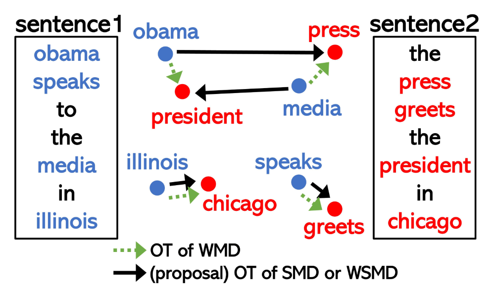
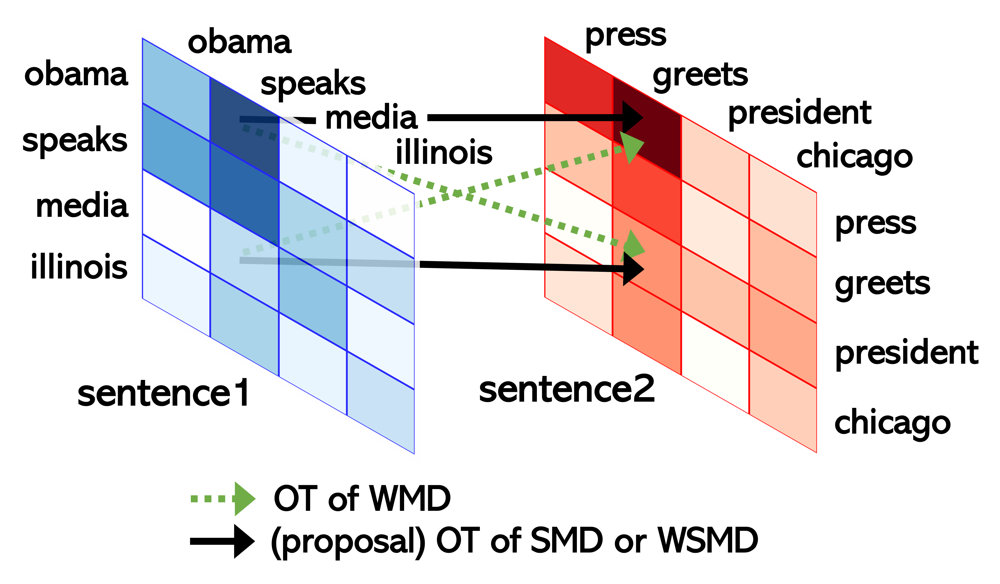

# WSMD

> [Improving word mover’s distance by leveraging self-attention matrix](https://arxiv.org/abs/2211.06229)                 
> [Hiroaki Yamagiwa](https://ymgw55.github.io/), [Sho Yokoi](https://www.cl.ecei.tohoku.ac.jp/~yokoi/), [Hidetoshi Shimodaira](http://stat.sys.i.kyoto-u.ac.jp/members/shimo/)                 
> *EMNLP 2023 Findings*

Word Mover's Distance (WMD) does not utilize word order, making it challenging to distinguish sentences with significant overlaps of similar words, even if they are semantically very different. Here, we attempt to improve WMD by incorporating the sentence structure represented by BERT's self-attention matrix (SAM). The proposed method is based on the Fused Gromov-Wasserstein distance, which simultaneously considers the similarity of the word embedding and the SAM for calculating the optimal transport between two sentences.

An illustration of OT for word embeddings
from sentence 1 to sentence 2.


An illustration of OT for SAMs from sentence 1 to sentence 2.


Note that the camera-ready version, i.e. version 2 on arXiv, is a significant update to version 1 on arXiv.

## Docker
This repository is intended to be executed in a Docker environment.

### Build
Create a Docker image as follows:
```bash
docker build -t ${USER}/wsmd docker
```

### Run
For example, those who do not mind running with root privileges can execute the container like this:
```bash
docker run --rm -it --name wsmd_env \
--gpus device=0 \
-v $PWD:/working \
${USER}/wsmd bash
```
Others should set the -u option appropriately based on the [docker document](https://docs.docker.com/engine/reference/commandline/run/).

## Dataset
We used the following datasets:
- PAWS: https://github.com/google-research-datasets/paws
- STSB: https://ixa2.si.ehu.eus/stswiki/index.php/STSbenchmark
- SICK: https://marcobaroni.org/composes/sick.html

For frequency information of words for SIF, we used [enwiki_vocab_min200.txt](https://github.com/PrincetonML/SIF/blob/84b5b4c1c1ca20b6af19fc78cae005a1818ec571/auxiliary_data/enwiki_vocab_min200.txt) ．

Please prepare a directory structure like the following. 
Due to licensing restrictions that prevent the redistribution of certain datasets, such as PAWS QQP, we ask you to download the data directly from each source. 
```bash
data/
├── datasets
   ├── PAWSQQP
   │   ├── dev_and_test.tsv
   │   └── train.tsv
   ├── PAWSWiki
   │   ├── dev.tsv
   │   ├── sample.tsv
   │   ├── test.tsv
   │   └── train.tsv
   ├── SICK
   │   ├── SICK_test_annotated.txt
   │   ├── SICK_train.txt
   │   └── SICK_trial.txt
   ├── STSB
   │   ├── LICENSE.txt
   │   ├── correlation.pl
   │   ├── readme.txt
   │   ├── sts-dev.csv
   │   ├── sts-sample.csv
   │   ├── sts-test.csv
   │   └── sts-train.csv
   └── sif
       └── enwiki_vocab_min200.txt
```

To create sample datasets, you can use commands like the following:
```bash
head -n 11 data/datasets/PAWSWiki/train.tsv > data/datasets/PAWSWiki/sample.tsv
head -n 10 data/datasets/STSB/sts-train.csv > data/datasets/STSB/sts-sample.csv
```

## Save Embeddings
Calculate embeddings as follows. In the paper, we limited the dev set of PAWS Wiki to the first 1500 items. We are calculating embeddings for both this limited data and the entire data.
```bash
cd src
python save_model.py
```

## Calculation $BV_A$ (Bidirectional Attention Variability)
Calculate $BV_A$ as follows:
```bash
python calculate_BVA.py --model_name bert-base-uncased --root_dir /working
```

## Evaluations
Perform evaluations as follows. Note that this code performs WSMD for all layers and all heads, which can be very time-consuming. If necessary, it might be better to decide on the layers to extract from the dev set and change the code to calculate only a certain layer for the test set.
```bash
# BOWS, which does not use embeddings.
python eval_baseline.py --model_name bert-base-uncased --task PAWSWiki --dataset sample --whiten True --normalize False --full False --root_dir /working
# Other baselines, which use layer embeddings.
python eval_baseline.py --model_name bert-base-uncased --emb_layer 0 --task PAWSWiki --dataset sample --whiten True --normalize False --full False --root_dir /working
# SMD with uniform weight and idf weight.
python eval_smd_without_embeddings.py --model_name bert-base-uncased --task PAWSWiki --dataset sample --whiten True --normalize False --full False --root_dir /working
# SMD with normed weight such as WRD.
python eval_smd.py --model_name bert-base-uncased --emb_layer 0 --task PAWSWiki --dataset sample --whiten True --normalize False --full False --root_dir /working
# WSMD
python eval_wsmd.py --model_name bert-base-uncased --emb_layer 0 --task PAWSWiki --dataset sample --whiten True --normalize False --full False --lambd 0.5 --root_dir /working
```

Then, we collect all results as follows:
```bash
python collect_results.py --model_name bert-base-uncased --emb_layer 0 --attn_layer 6 --attn_layers "[4,5,6,7,8,9,10,11]" --task PAWSWiki --dataset sample --full False --root_dir /working
```
Here, `attn_layer` is choosed by dev set and `attn_layers` are choosed by $BV_A$.

## References
We have made use of many publicly available codes. We are particularly grateful for the codes from the following two repositories. Thank you.
- ROTS: https://github.com/zihao-wang/rots
- SynWMD: https://github.com/amao0o0/SynWMD


# Citation
If you find our code or model useful in your research, please cite our paper:
```
@inproceedings{DBLP:conf/emnlp/YamagiwaYS23,
  author       = {Hiroaki Yamagiwa and
                  Sho Yokoi and
                  Hidetoshi Shimodaira},
  editor       = {Houda Bouamor and
                  Juan Pino and
                  Kalika Bali},
  title        = {Improving word mover's distance by leveraging self-attention matrix},
  booktitle    = {Findings of the Association for Computational Linguistics: {EMNLP}
                  2023, Singapore, December 6-10, 2023},
  pages        = {11160--11183},
  publisher    = {Association for Computational Linguistics},
  year         = {2023},
  url          = {https://aclanthology.org/2023.findings-emnlp.746},
  timestamp    = {Wed, 13 Dec 2023 17:20:20 +0100},
  biburl       = {https://dblp.org/rec/conf/emnlp/YamagiwaYS23.bib},
  bibsource    = {dblp computer science bibliography, https://dblp.org}
}
```